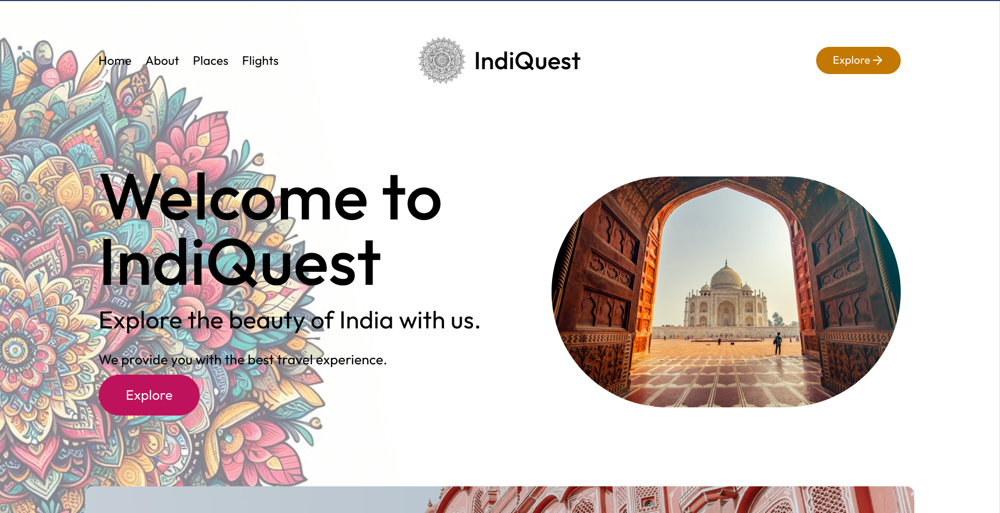

### Welcome to IndiQuest - your gateway to exploring the incredible diversity and richness of India!
---

Our web application is designed to be your ultimate companion for discovering the many facets of India's culture, history, and modern-day offerings. Whether you're a curious traveler, a foodie seeking new flavors, or simply someone fascinated by the vibrant tapestry of Indian life, IndiQuest is here to guide you on an unforgettable journey.

With IndiQuest, you can:

1. Discover Places: From the majestic Himalayan peaks to the serene backwaters of Kerala, India is a land of breathtaking beauty. Our app helps you explore iconic landmarks, hidden gems, and off-the-beaten-path destinations, providing you with detailed information, stunning visuals, and insider tips to make the most of your visit.

2. Savor the Flavors: Indian cuisine is a universe unto itself, with an endless array of regional specialties, street food delights, and fine dining experiences. IndiQuest is your culinary compass, helping you navigate the mouthwatering world of Indian food. Discover the best restaurants, learn about local ingredients and cooking techniques, and even access traditional recipes to recreate the magic at home.

3. Immerse in Culture: India's cultural heritage is a treasure trove waiting to be explored. From ancient temples and colorful festivals to traditional art forms and contemporary innovations, IndiQuest takes you on a deep dive into the soul of India. Learn about the country's diverse religions, customs, and languages, and gain a deeper appreciation for the rich tapestry that makes India so unique.

4. Plan Your Adventure: Whether you're planning a solo backpacking trip, a family vacation, or a luxury getaway, IndiQuest is your one-stop-shop for all things travel in India. Get personalized recommendations based on your interests, access practical information on visas, transportation, and accommodations, and connect with local experts and fellow travelers for advice and inspiration.
